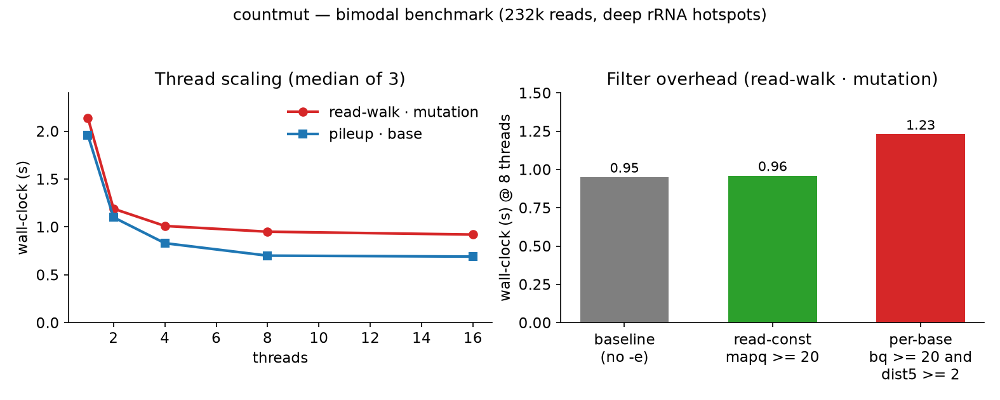

# CountMut

At each site in a modification assay you want the same small number: how many
reads still show the reference base, how many show the conversion, and what
that is as a rate. Existing tools made this hard — a flag for every QC idea,
two BAM-walking strategies that disagreed on deep overlapping sites, and
read-level filters priced once per aligned position instead of once per read.

CountMut collapses this into one design: a single base counter, QC and trimming
as expressions (the samtools grammar, in C), and two BAM-walks that provably
agree. What you *see* is an output format — the per-base table, an allele VCF,
or a column template you write yourself. On a deep rRNA transcriptome
(784 k reads / 90 Mb) a genome-wide `mapq >= 20` adds ~0.5 s, and the per-base
filter was cut ~3×.

```bash
pip install -e .
```

## Quick start

```bash
# every base, per strand                       -> composition table
countmut -i in.bam -r ref.fa -o depth.tsv

# your own columns (e.g. an A/T conversion ratio) -> custom output template
countmut -i in.bam -r ref.fa -o mine.tsv \
  --output-format "{pos+1}\t{ref}\t{a}\t{t}\t{round(t/(a+t)+0*a, 4)}" \
  --fmt-header "pos\tref\tA\tT\trate"

# alleles as VCF                               -> VCF
countmut -i in.bam -r ref.fa --vcf -o allele.vcf
```

There is no `--mode`, no `--ref-base`/`--mut-base`: one counter, and the output
is whatever you choose. Bare runs print the per-strand base composition
(`ref depth a c g t n`); `--vcf` gives an allele VCF; `--output-format` gives
your own columns (a conversion ratio is just `{t}/({c}+{t})`). Output is per
strand by default, and `--strandless` merges the two strands.

## Filtering with one expression instead of ten flags

In RNA there is no genomic mutation to count: the "converted" base is a
modification read out through reverse transcription, so the conversion rate
reports modification level rather than a variant. Whatever your sample, the
QC and trimming live in one expression language — read-level rules are `-e`
expressions, site-level rules `-p`, in the samtools `filter=` grammar,
evaluated inside the C core. The old `--min-mapq` / `--trim-*` flags are gone —
write them as `-e` expressions.

```bash
# quality, and not on the error-prone read ends
countmut -i x -r ref -o out -e "mapq >= 20 and bq >= 20 and dist5 >= 2"

# one sample
countmut -i x -r ref -o out -e "tag('RG') == 'sampleA'"

# samtools-style: low mismatch, not a PCR duplicate, read 1 only
countmut -i x -r ref -o out -e "[NM] <= 3 and not (flag.dup ~= 0) and flag.read1 != 0"

# site-level: only well-covered sites with ≥2 G reads
countmut -i x -r ref -o out -p "depth >= 5 and g >= 2"
```

**`-e` is also a group router.**  A bare boolean expression is a filter
(`true` → count, `nil`/`false` → drop), but an expression that returns an
integer `0..3` routes each kept base into that **group**; `true` routes to
group 0.  Anything else drops the base (with a stderr warning).  The split
shows up in `--output-format` templates as per-group cells `{a.0}` … `{n.3}`
(plain `{a}` stays the total over all groups):

```bash
# bisulfite A->G, 2-group router: group 1 = high-conversion bases, group 0 =
# everything else that passes the hard NS gate (low quality / read-end trim)
countmut -i x -r ref -o out \
  -e "([NS] <= 1) and (([Yf] >= 1 and [Zf] <= 3 and bq >= 20 and qpos >= 2 and qlen - qpos > 2) and 1 or 0)" \
  --output-format "{chrom}\t{pos+1}\t{strand}\t{motif}\t{a.0}\t{a.1}\t{g.0}\t{g.1}" \
  --motif-pad 15 --fmt-header "chrom\tpos\tstrand\tmotif\tu0\tu1\tm0\tm1"
```

Most filters use roughly ten variables — `mapq`, `bq` (base quality), `flags`,
`qpos` (position in the read), `dist5`/`dist3` (distance to the read ends),
`base`/`ref`, `tag('XX')`, and `rname`. A couple of things are worth knowing.
A missing tag is nothing: comparing `tag('NM')` *errors* and drops that read,
so guard with `exists('NM')` when tags are optional. Only the six per-base
values (`qpos`, `bq`, `base`, `ref`, `dist5`, `dist3`) cost anything to
evaluate; everything else runs once per read and is essentially free. A syntax
error stops the run (exit code 2), so a typo can never silently change your
numbers.

The full grammar is in
[`docs/filter_grammar.md`](docs/filter_grammar.md), with an exhaustive
reference in [`docs/expression_reference.md`](docs/expression_reference.md).

## Output format

`--output-format` takes a **row template**: literal text plus `{expr}`
placeholders evaluated per site over the site values (`chrom`, `pos`,
`strand`, `motif`, `ref`, `depth`, `a c g t n`, `ins del ref_skip fail`, and
per-group counts `a.0` … `n.3` whenever `-e` routes into groups). Placeholders
run real Lua, so you can compute cells — a conversion ratio is just
`{t}/({c}+{t})` — and `round(x, n)` and `int(x)` are helpers for formatting:

```bash
countmut -i x -r ref -o out \
  --output-format "{pos+1}\t{ref}\t{a}\t{t}\t{round(t/(a+t), 4)}"
```

`{{` writes a literal `{`; a placeholder that yields nothing renders as an
empty cell. `--fmt-header "…"` supplies the header line (`\t`/`\n` expanded);
without it custom templates print no header. With no `--output-format`, the
default output is the per-strand `ref depth a c g t n` composition table
(`--vcf` instead produces an allele VCF).

## Engines and options

Two BAM-walking strategies live in the C core and emit identical output, so
the engine choice only affects speed (`--engine auto` uses the pileup walk for
the per-position counting). The options are few: input/reference/output,
`--region`, `--threads/-t`, `--engine`, `--strandless`, `--count-indels`,
`--vcf` (+ `--min-depth`/`--min-allele-support`), `-e`/`-p`, `--motif-pad`,
and `--output-format`/`--fmt-header`.

## Input formats

**BAM** (indexed, fast, threaded) and **SAM** (plain or gzipped — auto-transcoded
to a temp BAM + index, same output as the equivalent BAM) are both supported,
detected automatically. **CRAM** is not read by this self-contained core; convert
first: `samtools view -b in.cram -o out.bam` — for a CRAM with an embedded
reference, that conversion also works without a separate FASTA.

## Performance



Measured on a bimodal benchmark (232 k reads, 23.2 M read-bases, deep rRNA-style
hotspots): composition counting reads 1.30 s @1 thread → 0.31 s @16 (read-walk)
and 1.96 → 0.70 s (pileup); both walks are byte-identical (the dynamic work
queue keeps deep hotspots from serializing).  Read-constant filters run once
per read (≈ free); only true per-base filters
`qpos/bq/base/ref/dist5/dist3` add cost (~0.3 s @8 threads for `bq and dist5`).
`tests/make_bench_bam.py` regenerates the fixture; `scripts/plot_perf.py` re-renders
this figure.

## License

MIT